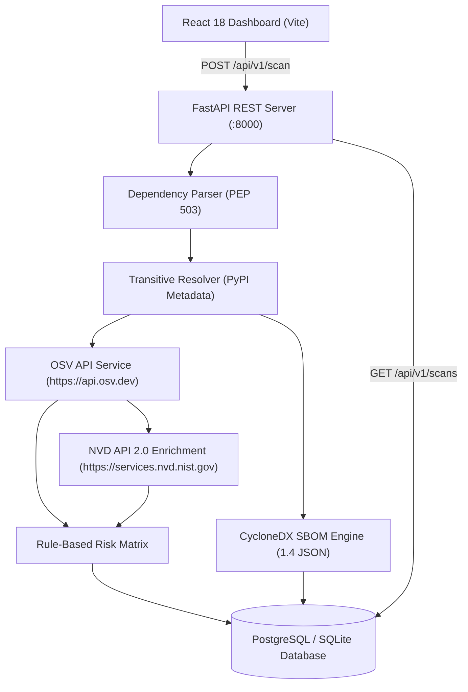
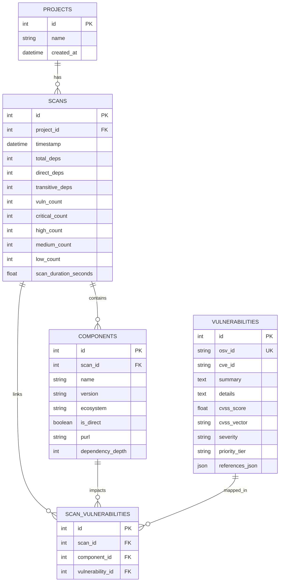

# SecureSBOM Architecture Specification

## 1. System Architecture Overview

SecureSBOM (PRJ_56) is engineered as a decoupled, multi-tiered security pipeline comprising a React Vite single-page application frontend, a FastAPI REST API service, an asynchronous vulnerability correlation engine, a CycloneDX 1.4 JSON SBOM generator, and an ORM persistence layer backed by PostgreSQL/SQLite.

---

## 2. Component Subsystems

### 2.1 Dependency Extraction & Transitive Graph Resolution
- [`dependency_parser.py`](file:///c:/Users/shrey/OneDrive/Documents/Project/backend/app/services/dependency_parser.py): Parses `requirements.txt` manifests, strips comments/options, normalizes package names per PEP 503, and extracts version specifiers safely without code execution.
- [`transitive_resolver.py`](file:///c:/Users/shrey/OneDrive/Documents/Project/backend/app/services/transitive_resolver.py): Queries PyPI JSON release endpoints to inspect `requires_dist` attributes up to depth level 2, resolving direct and transitive components cleanly.

### 2.2 CycloneDX SBOM Generator
- [`sbom_generator.py`](file:///c:/Users/shrey/OneDrive/Documents/Project/backend/app/services/sbom_generator.py): Utilizes `cyclonedx-python-lib` to construct OWASP-compliant CycloneDX 1.4 JSON documents containing metadata, component inventory, package URLs (`purl`), and dependency graph relationships, outputting to [`output/bom.json`](file:///c:/Users/shrey/OneDrive/Documents/Project/output/bom.json).

### 2.3 Vulnerability Correlation & Enrichment Engine
- [`osv_service.py`](file:///c:/Users/shrey/OneDrive/Documents/Project/backend/app/services/osv_service.py): Queries Google OSV API (`/v1/query`) with in-memory caching and exponential backoff retry logic.
- [`nvd_service.py`](file:///c:/Users/shrey/OneDrive/Documents/Project/backend/app/services/nvd_service.py): Enriches CVE records with official NIST NVD CVSS v3.1 base scores and vector strings when available.
- [`correlation_service.py`](file:///c:/Users/shrey/OneDrive/Documents/Project/backend/app/services/correlation_service.py): Unifies component metadata with vulnerability findings.

### 2.4 Risk Prioritization Matrix
- [`prioritization.py`](file:///c:/Users/shrey/OneDrive/Documents/Project/backend/app/services/prioritization.py): Implements deterministic rule mapping without ML, assigning findings to priority tiers:
  - `P1-Critical`: CVSS >= 9.0 or explicit "CRITICAL"
  - `P2-High`: CVSS 7.0 - 8.9 or explicit "HIGH"
  - `P3-Medium`: CVSS 4.0 - 6.9 or explicit "MEDIUM"
  - `P4-Low`: CVSS 0.1 - 3.9 or explicit "LOW"
  - `P5-Info`: Unknown severity / missing score

---

## 3. Database Entity-Relationship (ER) Schema

---

## 4. Security Considerations

1. **Zero Execution Policy:** The scanner strictly parses manifest text and PyPI metadata JSON. Uploaded/scanned project code is never imported, executed, or compiled.
2. **Secrets & Credentials Management:** All sensitive tokens (such as `NVD_API_KEY`) are managed exclusively via environment variables (`.env`). `.env` is explicitly gitignored and a template is maintained at [`.env.example`](file:///c:/Users/shrey/OneDrive/Documents/Project/.env.example).
3. **API Resilience:** External calls to OSV and NVD APIs feature timeout limits, in-memory caching, and graceful fallback to ensure scanner uptime even if external APIs experience outage or rate limits.
